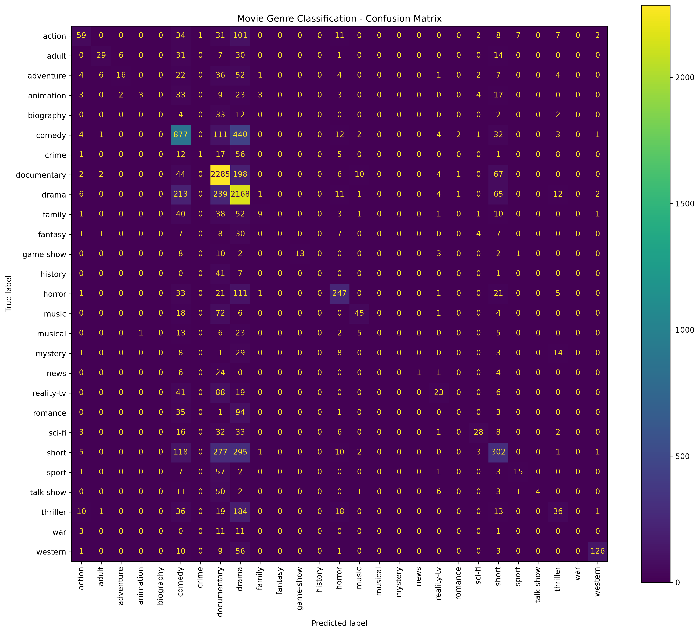

```text
README.md
```


````markdown
# 🎬 Movie Genre Classification

A Machine Learning project that predicts the genre of a movie based on its plot summary or textual description.

This project was developed as part of the **CODSOFT Machine Learning Internship**.

---

## 📌 Project Overview

Movie genres can often be identified from the story or plot of a movie. In this project, a Machine Learning model is trained to classify movies into different genres based on their textual plot descriptions.

The project uses:

- **TF-IDF (Term Frequency-Inverse Document Frequency)** for converting text into numerical features.
- **Logistic Regression** for classifying the movie genre.

The trained model can predict the genre of a new movie plot entered by the user.

---

## 🎯 Objective

The main objective of this project is to:

- Process movie plot summaries using Natural Language Processing.
- Convert textual descriptions into numerical features.
- Train a Machine Learning classification model.
- Predict the genre of unseen movie descriptions.
- Evaluate the performance of the trained model.
- Provide an interactive interface for users to enter movie plots and obtain predictions.

---

## 📊 Dataset

The dataset contains movie information including:

- Movie ID
- Movie Title
- Movie Genre
- Movie Description

### Dataset Statistics

- **Total movies:** 54,214
- **Number of genres:** 27
- **Training samples:** 43,371
- **Validation samples:** 10,843

### Genres

The dataset contains the following 27 genres:

```text
action
adult
adventure
animation
biography
comedy
crime
documentary
drama
family
fantasy
game-show
history
horror
music
musical
mystery
news
reality-tv
romance
sci-fi
short
sport
talk-show
thriller
war
western
````

---

## 🧠 Technologies Used

* Python
* Pandas
* Scikit-learn
* TF-IDF
* Logistic Regression
* Joblib
* Matplotlib
* Streamlit

---

## ⚙️ Machine Learning Workflow

```text
Movie Dataset
      ↓
Data Cleaning
      ↓
Train / Validation Split
      ↓
Text Preprocessing
      ↓
TF-IDF Feature Extraction
      ↓
Logistic Regression
      ↓
Model Evaluation
      ↓
Genre Prediction
      ↓
Streamlit Web Interface
```

---

## 🔤 TF-IDF

TF-IDF stands for **Term Frequency-Inverse Document Frequency**.

It converts movie descriptions into numerical values that can be understood by a Machine Learning model.

In this project:

* English stop words are removed.
* Up to **50,000 features** are used.
* The TF-IDF vectorizer is fitted on the training data.
* The same vectorizer is used for validation and test data.

---

## 🤖 Machine Learning Model

### Logistic Regression

Logistic Regression is used as the classification algorithm.

The model learns the relationship between words in movie descriptions and their corresponding genres.

The trained model is then used to predict the genre of new movie descriptions.

---

## 📈 Model Performance

The final model achieved:

| Metric                 |     Result |
| ---------------------- | ---------: |
| Validation Accuracy    | **57.98%** |
| Final Test Accuracy    | **58.05%** |
| Final Test Macro F1    | **0.2578** |
| Final Test Weighted F1 | **0.5305** |

The model correctly classified:

**31,463 out of 54,200 test movies.**

### Accuracy

```text
Final Test Accuracy: 58.05%
```

The dataset is highly imbalanced, with genres such as drama and documentary having significantly more samples than smaller categories such as war, news, and biography. Therefore, performance varies between genres.

---

## 📊 Confusion Matrix

A confusion matrix was generated to analyze the classification performance across the different movie genres.



---

## 🖥️ Streamlit Application

The project also includes an interactive Streamlit web application.

Users can enter a movie plot summary and the trained model predicts its genre.

### Example

**Input:**

```text
A young detective investigates a series of mysterious
murders in a small town. As he follows hidden clues,
he discovers that the killer is closer to him than
he expected.
```

**Prediction:**

```text
THRILLER
```

---

## 📁 Project Structure

```text
movie-genre-classification/
│
├── app.py
├── movie_genre_classification.py
├── predict_genre.py
├── requirements.txt
├── README.md
├── .gitignore
│
└── confusion_matrix.png
```

### File Description

| File                            | Description                              |
| ------------------------------- | ---------------------------------------- |
| `app.py`                        | Streamlit web application                |
| `movie_genre_classification.py` | Data processing, training and evaluation |
| `predict_genre.py`              | Command-line movie genre prediction      |
| `confusion_matrix.png`          | Model evaluation visualization           |
| `requirements.txt`              | Python dependencies                      |
| `README.md`                     | Project documentation                    |
| `.gitignore`                    | Files excluded from GitHub               |

---

## 🚀 How to Run the Project

### 1. Clone the repository

```bash
git clone https://github.com/nafisathafa/CODSOFT_TASK1.git
```

### 2. Open the project folder

```bash
cd movie-genre-classification
```

### 3. Create a virtual environment

```bash
python -m venv venv
```

### 4. Activate the virtual environment

#### macOS / Linux

```bash
source venv/bin/activate
```

#### Windows

```bash
venv\Scripts\activate
```

### 5. Install dependencies

```bash
pip install -r requirements.txt
```

---

## ▶️ Train the Model

Run:

```bash
python movie_genre_classification.py
```

This will:

1. Load the movie dataset.
2. Clean the data.
3. Split the dataset.
4. Convert descriptions into TF-IDF features.
5. Train the Logistic Regression model.
6. Evaluate the model.
7. Generate a confusion matrix.
8. Save predictions.
9. Save the trained model and TF-IDF vectorizer.

---

## 🔮 Predict a Movie Genre

Run:

```bash
python predict_genre.py
```

Enter a movie plot when prompted.

Example:

```text
Movie plot: A spaceship travels to another planet where astronauts encounter an unknown alien civilization.

Predicted Movie Genre: sci-fi
```

Type:

```text
exit
```

to stop the program.

---

## 🌐 Run the Streamlit Application

Run:

```bash
streamlit run app.py
```

The application will open in your browser.

Users can enter a movie plot summary and click **Predict Genre** to receive the predicted movie genre.

---

## ⚠️ Limitations

The dataset contains a significant imbalance between genres. Popular genres such as **drama, documentary, and comedy** contain many more samples than some smaller genres.

Because of this imbalance:

* The model performs better on frequently occurring genres.
* Some less represented genres are harder to classify.
* The Macro F1 score is lower than the overall accuracy.

---

## 🔮 Future Improvements

The project can be improved by:

* Using larger and more balanced datasets.
* Applying advanced NLP techniques.
* Experimenting with Word2Vec or other word embeddings.
* Trying Support Vector Machines and Naive Bayes.
* Using transformer-based language models.
* Improving classification of minority genres.
* Using hyperparameter tuning.
* Adding top-3 genre predictions.
* Improving the Streamlit user interface.

---

## 👩‍💻 Author

**Nafisa Thafa**

B.E. Computer Science Engineering

---

## 🏆 Internship

This project was completed as part of the:

**CODSOFT Machine Learning Internship**

---

## ⭐ Conclusion

This project demonstrates how Natural Language Processing and Machine Learning can be used to classify movies based on their plot descriptions.

The combination of **TF-IDF and Logistic Regression** achieved a final test accuracy of **58.05%**, and the trained model can be used through both a command-line prediction program and an interactive Streamlit web application.

````

### One important thing before you push it

Your README currently says:

```text
requirements.txt
````

but we haven't created that file yet.

Create it with:

```bash
touch requirements.txt
```

Then put this inside:

```text
pandas
scikit-learn
matplotlib
joblib
streamlit
```

Then run:

```bash
git add README.md requirements.txt
git commit -m "Add project documentation and requirements"
git push
```

After that, refresh GitHub and your repository will look much more complete and professional.
